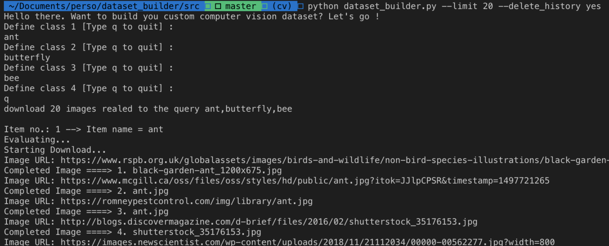
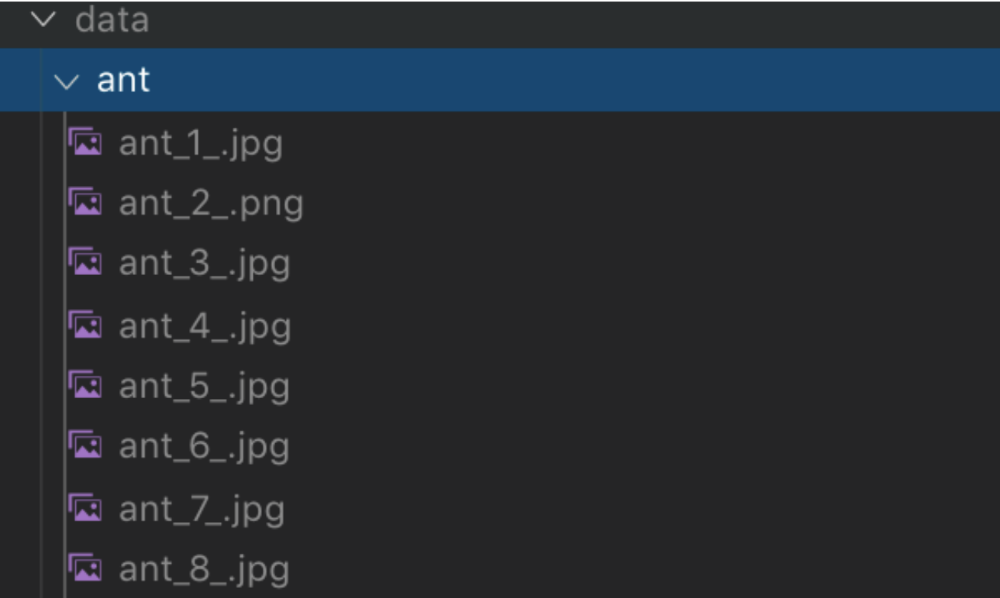

# Dataset Builder

A script to help you quickly build custom computer vision datasets for classification and detection.

If you opt for the detection task, the script uploads the downloaded images with the corresponding labels to http://makesense.ai (or locally to http://localhost:3000) so that all you have to do in annotate yourself. 

Once the annotation is done, your labels can be exported and you'll be ready to train your awesome models.

### Requirements:

- google_images_download: ``pip install google_images_download``
- Selenium: pip install -U selenium
- ChromeDriver 77.0.3865.40


In case you wish to run Maske Sense locally:

```bash
# clone repository
git clone https://github.com/SkalskiP/make-sense.git

# navigate to main dir
cd make-sense

# install dependencies
npm install

# serve with hot reload at localhost:3000
npm start
```

### Example:

When you run the script, you can specify the following arguments:

- `output_directory`: the root folder when images are downloaded
- `limit`: the maximum number of downloaded images per category
- `delete_history`: whether you choose to erase previous downloads or not
- `task`: classification, detection or segmentation
- `driver`: path to chrome driver
- `run_local` : whether or not to use makesense locally

```bash
python dataset_builder.py --limit 20 --delete_history yes
```
Once the script runs, you'll be asked to define your classes (or queries)



Here's what the output looks like after the download:



### Object detection with make-sense:

This only works if you choose a **detection** or **segmentation** task

Make Sense is an awesome open source webapp that lets you easily label your image dataset for tasks such as localization.

You can check it out here: https://www.makesense.ai/ 
You can also clone it and run it locally (for better performance): https://github.com/SkalskiP/make-sense

In order to use this tool, I'll be running it locally and interface with it using Selenium: Once the dataset is downloaded, Selenium opens up a Chrome browser, upload the images to the app and fill in the label list: this ultimately allows you to annotate.

### Demo [Youtube video]

<p align="center">
  <a href="https://www.youtube.com/watch?v=qXLvMr9mrP4">
    
  </a>
</p>

### TODO :grin:
Please feel free to contribute ! Report any bugs in the issue section, or request any feature you'd like to see shipped:

- [ ] Accelerate the download of images via multiprocessing
- [ ] Apply a quality check on the images
- [ ] Integrate automatic tagging using pre-trained networks


### LICENSE

Please be aware that this code is under the GPL3 license. 
You must report each utilisation of this code to the author of this code (ahmedbesbes). 
Please push your code using this API on a forked Github repo public. 